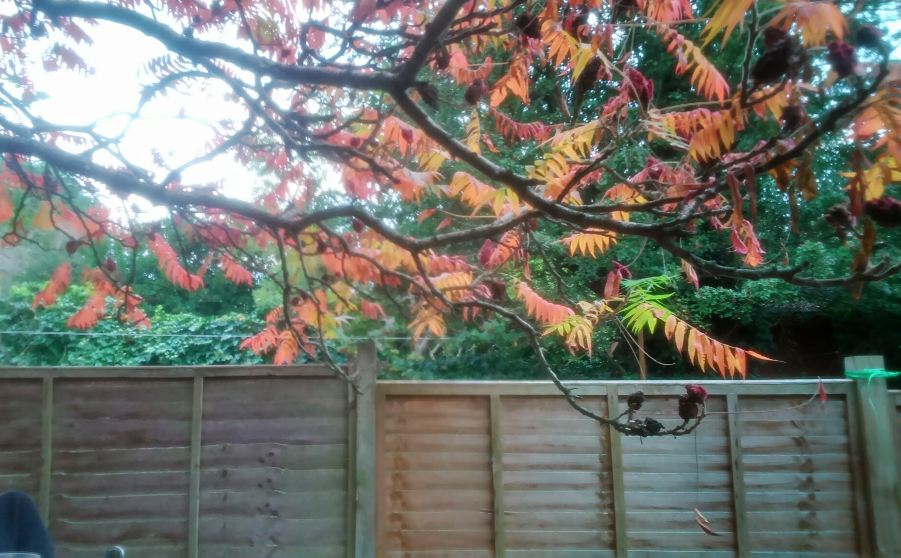

Allá en Alcalá -o en Granada- el Otoño pasa casi inadvertido. Hay días sueltos, a veces semanas, pero los cambios son muy bruscos, como la granizada que cayó esta semana. Un día es verano pero con un poquito más fresco, y al día siguiente cae la tromba de granizo y llega el frío. Si hace sol, sigue pareciendo verano. Si hace malo, no apetece salir a la calle.

Aquí encuentro tonalidades de manual. Rojos, amarillos, mezclados con algún verde salteado, bañado por un sol ya relativamente bajo que ayuda a que la ilusión de una falsa primavera se diluya. El día te invita a que, aunque cada vez necesites más capas de ropa, salgas a la calle, y disfrutes de estos collages de hojas en el suelo mezcladas con hierba. Gente disfrutando de las últimas horas de sol en los parques. Y españoles comiendo cocido en el jardín, que es lo que toca hoy.

