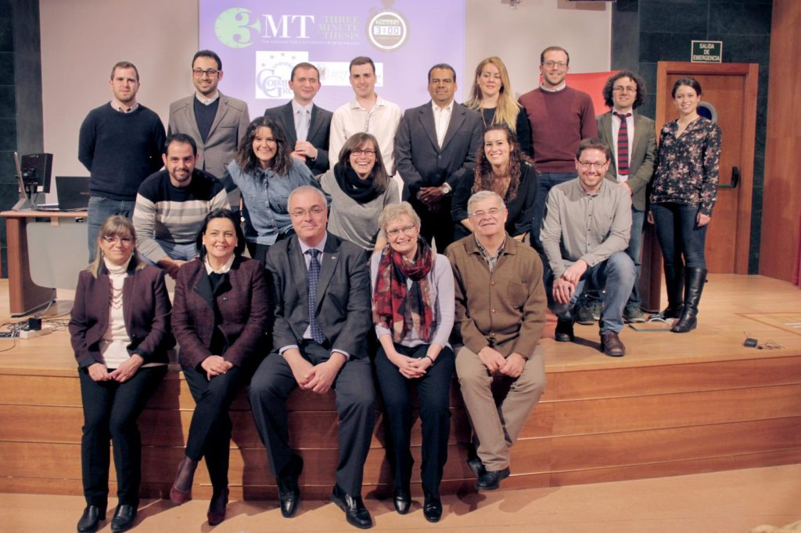

[Three minute thesis](https://en.wikipedia.org/wiki/Three_Minute_Thesis) es una iniciativa internacional con sólo un objetivo: contar tu tesis en tres minutos, sólo con ayuda de una diapositiva estática, para una audiencia inteligente pero no especializada. Es un reto mayúsculo para los que nos pasamos horas detrás de una pantalla de ordenador, intentando traducir líneas y líneas de código a un lenguaje especializado que pueda llegar a otro público igualmente especializado. Es **divulgación**, con todo lo que ello conlleva.

Y a mí me atrae muchísimo la divulgación. Era la oportunidad de oro para tirarme de lleno a la piscina y aprender. Cuando me tiré sin mirar si había agua siquiera allá por octubre no pensé lo que me iba a encontrar. Ha sido una experiencia inolvidable, donde he conocido a gente extremdamente interesante que comparte estos mismos intereses, donde he aprendido muchísimas cosas de los mejores profesionales, y que me llevo como mayor premio que atesoraré toda la vida. Creo que es el principio de una hermosa historia.

\[caption id="attachment\_586" align="aligncenter" width="764"\] Participantes en la primera fase del 3MT\[/caption\]

Y sí, **al final gané**, en la versión local. Pero yo ya había ganado con todo lo demás. No os puedo transmitir lo maravillosa que ha sido toda esta experiencia. Simplemente tengo palabras de agradecimiento a todos los que lo han hecho posible. A la escuela de posgrado, la universidad y el vicerrectorado de internacionalización, y muy especialmente a Maria Teresa Bajo, que organizaron la competición con muchísimo amor y dedicación. A los profesores de todos los cursos de formación que hemos tenido, de divulgación y de inglés: Meca, Susana, Emilio y Carlos, que ha sido la constante en esta ecuación. Y por supuesto, a todos esos maravillosos concursantes, con los que hemos construido una experiencia de aprendizaje inolvidable, y que espero nos sigamos viendo mucho más allá de que termine este concurso y otros.

Próxima parada... Famelab? Quien sabe!
