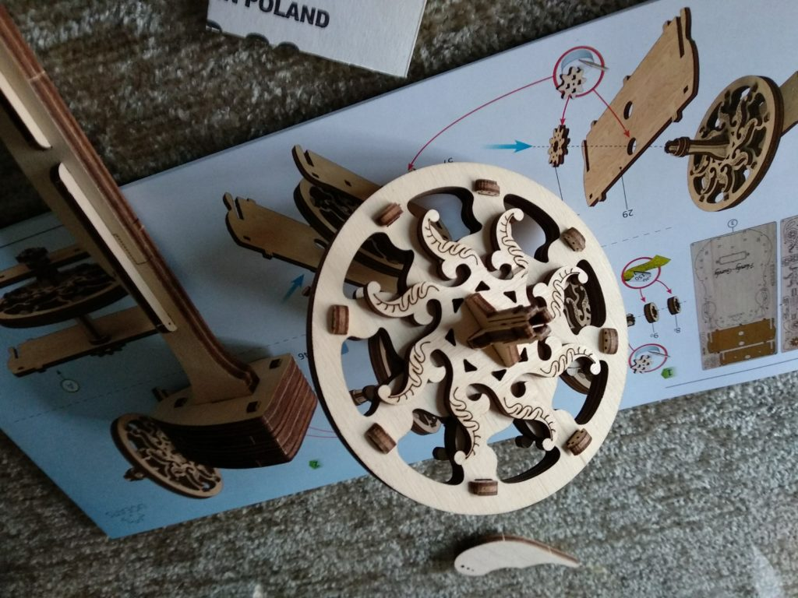

Siempre me han fascinado los instrumentos musicales, especialmente los que se usaban en música antigua como el [dulcimer](https://es.wikipedia.org/wiki/Dulcémele), el [arpa](https://es.wikipedia.org/wiki/Arpa) o la [zanfona](https://es.wikipedia.org/wiki/Zanfona). Por eso mi alegría fue máxima al encontrar una campaña muy prometedora en kickstarter: [UGEARS Hurdy Gurdy,](https://www.kickstarter.com/projects/978262034/ugears-hurdy-gurdy-unique-mechanical-musical-model/) que prometía enviar unos recortables en madera para poder construir una Zanfona (_Hurdy Gurdy_ en inglés).

Por fin me ha llegado el material a casa, y planeo ponerme a mover cielo y tierra para poder terminarla y empezar a hacer cosas que suenen _viejunas_, como a mi me encanta. Por lo pronto he empezado por la rueda, parte fundamental. Ya iré posteando los avances por aquí.

