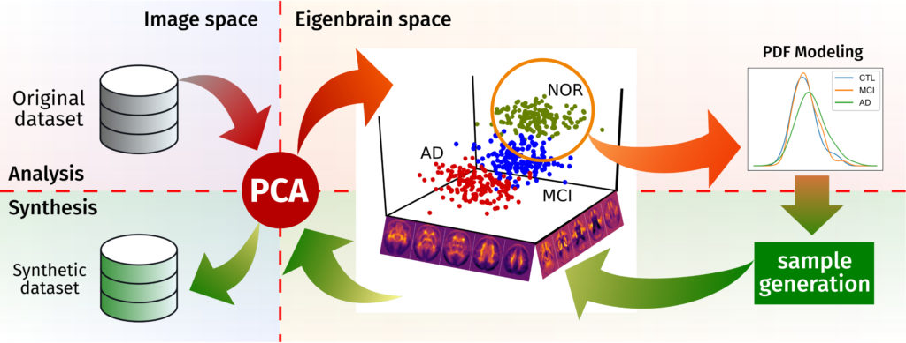

Acabamos de publicar un nuevo trabajo en _Frontiers in Neuroinformatics_, en el que probamos el nuevo método que hemos desarrollado para aumentar datos y estandarizar los métodos de evaluación de diferentes sistemas [CAD](https://en.wikipedia.org/wiki/Computer-aided_diagnosis) en neuroimagen. Podéis leer el artículo [aquí:](https://www.frontiersin.org/articles/10.3389/fninf.2017.00065/full)

Martinez-Murcia FJ, Górriz JM, Ramírez J, Illán IA, Segovia F, Castillo-Barnes D and Salas-Gonzalez D for the Alzheimer's Disease Neuroimaging Initiative (2017) Functional Brain Imaging Synthesis Based on Image Decomposition and Kernel Modeling: Application to Neurodegenerative Diseases. _Front. Neuroinform_. 11:65. doi: [10.3389/fninf.2017.00065](http://doi.org/10.3389/fninf.2017.00065)

_Grosso modo_, nuestro método proyecta las imágenes funcionales al espacio _eigenbrain_, el espacio PCA definido por los vectores propios de la base de datos. Aquí se modela -según el método utilizado- la distribución de probabilidad que sigue cada uno de los grupos, y una vez se ha generado el modelo, se pueden extraer nuevas muestras aleatorias que sigan esa PDF en el espacio _eigenbrain_, que luego se pueden retroproyectar al espacio de la imagen. De este modo generamos muestras que pertenecen a la distribución original, pero no son iguales a ella.

Este método está implementado en el paquete brainSimulator, que se puede descargar libremente para su uso en [10.5281/zenodo.1042400](https://doi.org/10.5281/zenodo.1042400), y cuya documentación se puede encontrar aquí: [http://brainsimulator.readthedocs.io/.](http://brainsimulator.readthedocs.io/)

Preparar el paquete junto con su documentación, para poder instalarlo con pip o cualquier otro método estándar de instalación en python ha sido otra epopeya, que merece ser contada en otro tiempo y lugar.
