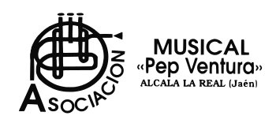
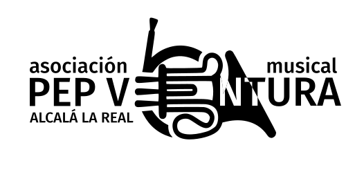

Desde hace tiempo me encargo de parte del diseño gráfico de la [asociación Musicalarte](http://www.asociacionmusicalarte.com), ahora responsabilidad compartida con mi querido Juanemi. Durante el proceso de diseño de algunos carteles, me he encontrado todo tipo de logos de patrocinadores o colaboradores. Particularmente, en el último concierto que dimos con la Asociación Musical Pep Ventura, su logo me dio algún quebradero de cabeza, por su orientación vertical y tipografía delgada. Aquí el logo original:

He de decir que soy un particular fan de los logos horizontales, y eso me llevó a cuadrarlo de la siguiente forma, para optimizar el espacio:

Pierde un poco en legibilidad, pero al menos es facilmente situable. A todo esto, es la versión debidamente vectorizada. Es la versión que finalmente quedó en el cartel. Pero como juego, me propuse darle un aspecto "renovado" a este logo tan icónico de la ciudad sin perder la esencia, que para mi es la información (Asociación Musical Pep Ventura), localización (Alcalá la Real -Jaén-) y el icono de la trompa. Jugando con diversas opciones llegué a un punto que me gustó:

Pero de alguna forma no era exactamente lo que me esperaba. Eso sí, tiene un aire interesante para conciertos de música clásica, o incluso un toque a "fundación". Aún así, la idea de "Asociación musical" predominaba sobre el propio nombre del compositor alcalaíno-catalán del que toma su nombre, a pesar de la negrita. Jugando de nuevo con el logo de la trompa (más solido), llegué a una opción que me encantó:

Está toda la información presente, mantiene la esencia del logo integrado en el texto, la trompa, y por fin predomina el nombre "Pep Ventura". Quizá necesita un retoque en las NT, para ganar legibilidad, pero la integración de esta forma me gana bastante, queda coqueto y el ratio de aspecto es adecuado a mi parecer. Por supuesto, son gustos, y esto no es más que un experimento sin validez oficial, pero me gustó el juego de caracteres en general.
