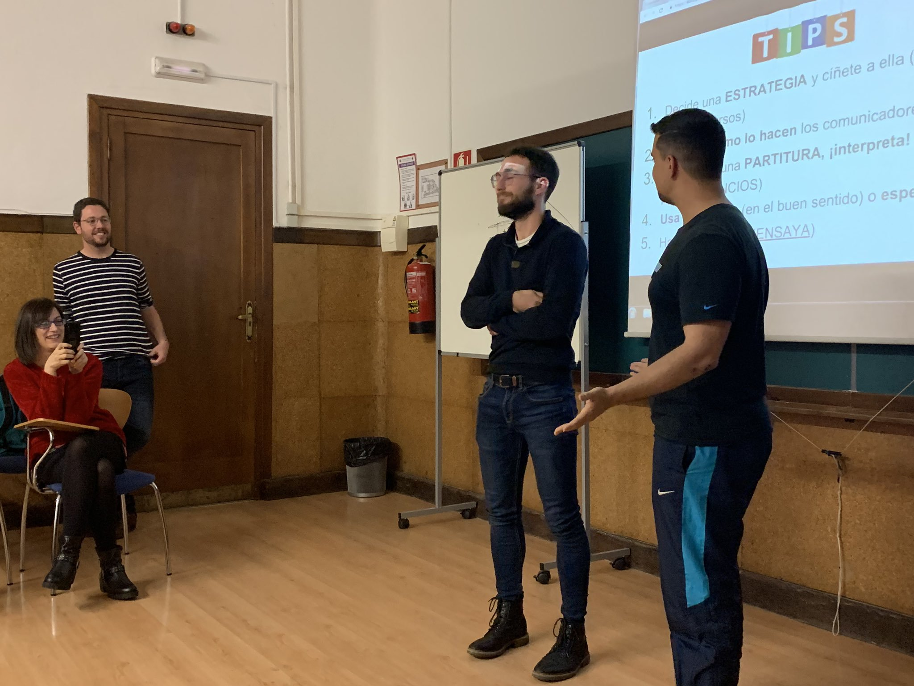
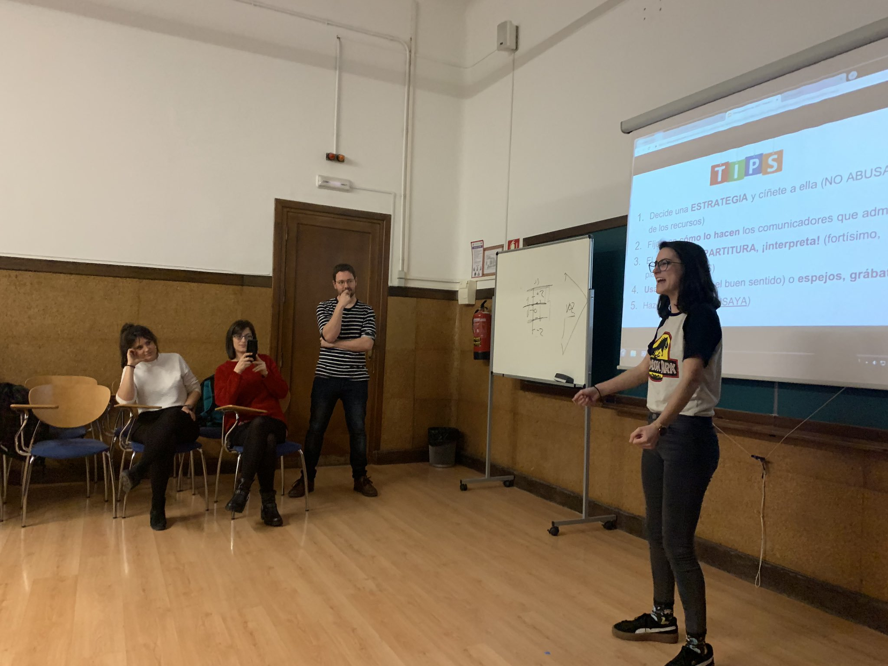
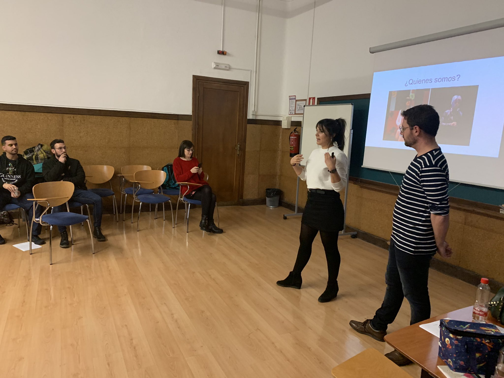

El pasado 4 de febrero, mi queridísima compañera en eso de cantar y ganar 3MT, [Ana Valverde](https://twitter.com/AValverdeC) y un servidor estuvimos impartiendo un taller de comunicación para los nuevos #3Minuters. Hablamos de cómo la interpretación puede ayudar a comunicar el mensaje generando interés y empatía en la audiencia, y abordando diferentes estrategias para lo mismo. Nos centramos en postura, _acting_ y voz, y nos lo pasamos genial con los ejercicios prácticos y los alumnos, enormes, como siempre.

¡Que tengáis mucha suerte!

PD: Gracias a Susana y Carlos, como siempre, por contar con nosotros ;)

UPDATE: Aquí está la presentación que nos curramos (que no nos dio apenas tiempo a ver):

<iframe src="https://docs.google.com/presentation/d/e/2PACX-1vTftia_7afEQ6eGHSJhzE3Wp90U6d3zCb-e6O7d4pmwzA8CPZId2ugpKKntsRuoEUfsp0WEM4aKVV9w/embed?start=false&amp;loop=false&amp;delayms=3000" frameborder="0" width="960" height="569" allowfullscreen="true" mozallowfullscreen="true" webkitallowfullscreen="true"></iframe>

Y aquí unas fotillos pa alegrar el personal:

::: {layout-ncol=3}

:::