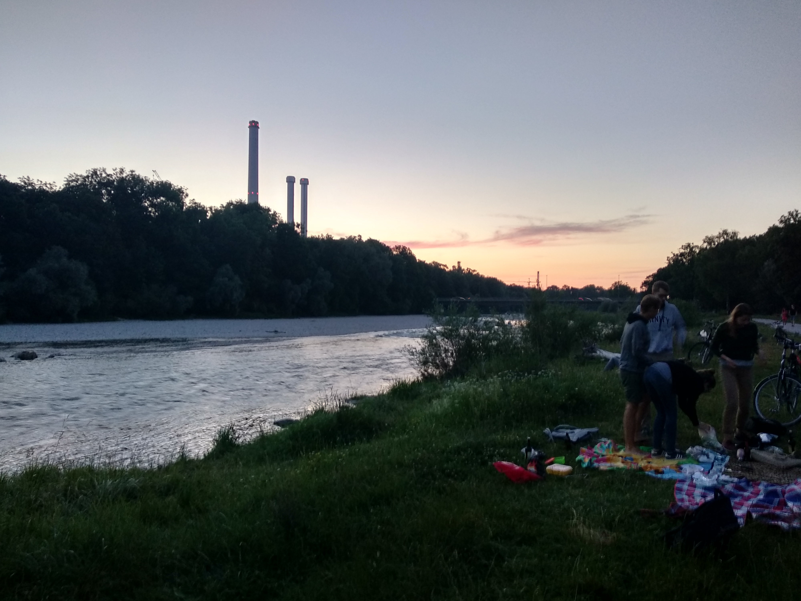
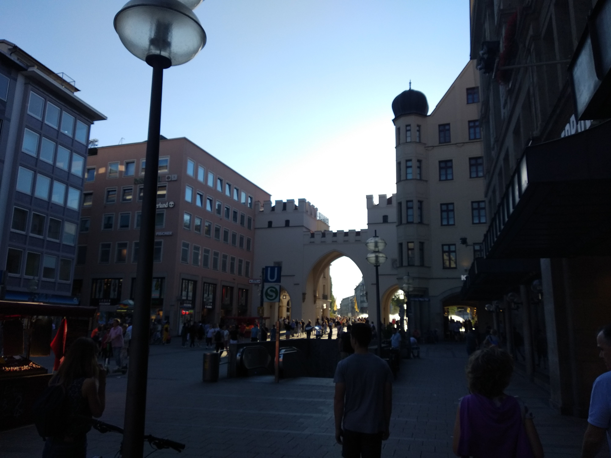

Esta semana he llegado a Munich. Concretamente a la Ludwig-Maximilien Universität München, gracias a la convocatoria nacional de ayudas para la movilidad internacional de jóvenes investigadores "José Castillejo". Al margen de los [problemas con la carrera científica en España](https://www.fjmartinezmurcia.es/2019/07/la-movilidad-internacional-y-el-sistema-cientifico-espanol/), sólo puedo estar agradecido tanto al ministerio de Ciencia como -sobre todo- a mi grupo de investigación por haber conseguido esta ayuda para venir aquí a realizar un proyecto muy, pero que muy, interesante.

::: {layout-ncol=3}

:::

¡Oh! ¡Qué intriga! ¿Qué proyecto es? Pues, para volver al redil del **Alzheimer**, me vengo a Múnich porque es uno de los centros de referencia europeos de la _Dominantly Inherited Alzheimer Network_ ([DIAN](https://dian.wustl.edu)), una iniciativa destinada a estudiar el Alzheimer hereditario. Al diferencia de lo que mucha gente cree, esta variedad de Alzheimer afecta tan solo a un 1%, pero sus efectos son devastadores. La afección se debe a ciertas variedades de los genes PSEN1, PSEN2 o APP que pasan de padres a hijos con un 50% de probabilidad, provocando que se desarrolle la enfermedad de Alzheimer muy temprano, entre los 30 y los 50 años. Podéis saber más sobre el Alzheimer hereditario en uno de los [vídeos divulgativos de DIAN](https://dian.wustl.edu/about/what-is-diad/).

Y aquí estoy, dispuesto a aplicar todo lo aprendido durante estos años en uno de los análisis más complejos que voy a realizar, esta vez incluyendo datos de diferentes modalidades de imagen (PET-FDG, PET-PIB y MRI). Probaremos diferentes modelos convolucionales, residuales y otros tipos de arquitecturas de _deep learning_ para tratar de encontrar una descomposición de los datos que permita una interpretación médica del progreso de la enfermedad.

¿Habrá suerte? Espero que sí. Solo queda trabajar.
