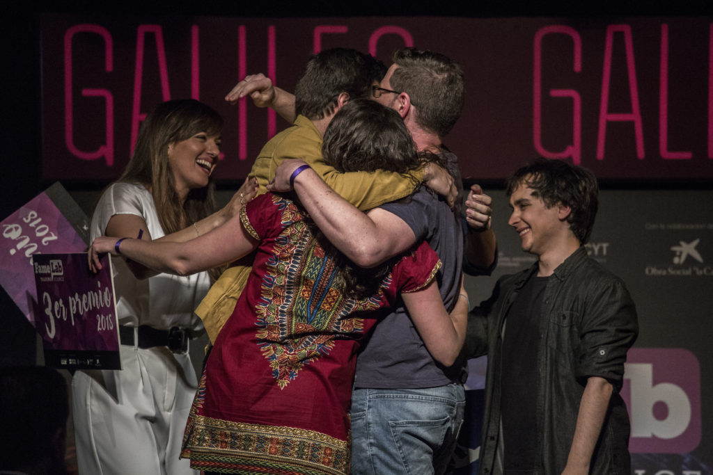

Finalmente, tras la maravillosa experiencia de la semifinal de **Famelab**, tuvimos unas cuantas jornadas más de convivencia y aprendizaje, incluyendo la genial Masterclass de  **James Piercy**, un conocido especialista en comunicación científica con un CV envidiable. Y tras ella, el momento más esperado, la **FINAL**.

Hace tiempo que, para mi, Famelab dejó de ser un concurso para pasar a ser una experiencia vital, en la que he conocido gente maravillosa, he aprendido muchísimo sobre ciencia y comunicación, y sobre todo, me lo he pasado genial. Y ha brindado oportunidades únicas, como esta gala final de Famelab en la mítica **Sala Galileo**, presentada por **Ana Morgade**, y a la que incluso asistieron los **Reyes de España**. Y mi **abuelo**, que ya es mucho decir.

Y este es el monólogo con el que me lucí (más o menos) frente a tan insigne públco:



No fue tan potente (para mi gusto) como el primero, pero me divertí mucho haciéndolo y aprendí bastante. Finalmente, el ganador fue aplastantemente el grandísimo **Juan Margalef**, seguidos por **Raquel Medialdea** e **Ignacio Crespo** (al que recomiendo seguir, ya que tiene una larga trayectoria en divulgación, y con todo esto va a ir a muuucho más). Premios muy merecidos, como los merecían todos y cada uno.

Y pa muestra, una de las fotos que más transmite el espíritu que nos ha contagiado este Famelab:

¡Mil gracias a todos!

::: {layout-ncol=3}

:::
