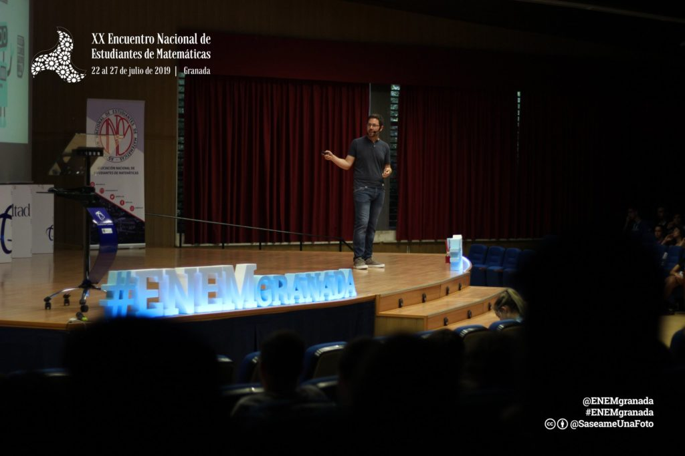

Siempre es un placer que me inviten a saraos, pero ya que lo hagan como "invited speaker" son palabras mayores. Y eso es lo que me pidieron para el [XX ENEM Granada](http://enemgranada.anemat.com). Que llegara y soltara una sarta de mis chominaicas. Y encima de las tablas, frente a cientos de estudiantes y post-estudiantes de matemáticas de todo el país.

¿Nervios? Muchísimos. Es un público muy exigente, al que le tenía que hablar de inteligencia artificial, una de las ramas [más importantes de la aplicación de matemáticas](https://towardsdatascience.com/no-machine-learning-is-not-just-glorified-statistics-26d3952234e3), y puede que donde muchos encuentren trabajo en el futuro. Pero a la vez, apenas se pasa de puntillas durante la carrera, y según confirmé después, la mayor parte de lo que aprenden lo hacen por su cuenta.

¿El reto? Hablar de machine learning a gente que tiene unos conocimientos y una base de matemáticas significativamente superior a la mía. Pero también desde una perspectiva divulgativa.

No sé si lo conseguí o no. Lo mejor es que me llevo una experiencia nueva, me atreví con mates (que no me había dado por ahí), hice incluso [simulaciones computacionales para visualizar las redes neuronales](https://github.com/pakitochus/201906_enem_auxiliary), y me lo pasé genial.

No puedo hacer otra cosa que agradecer a la organización, especialmente a Sara, por invitarme, por las fotos y por tratarme TAAAAN bien. A los asistentes, por su atención y por luego llenarme de preguntas, a las cuales a veces ni siquiera sabía yo responder (he hecho mis deberes después, así es como se aprende más). Y por invitarme a la cena, que ya sabéis como somos los músicos, vamos a los saraos por la comida na más.
