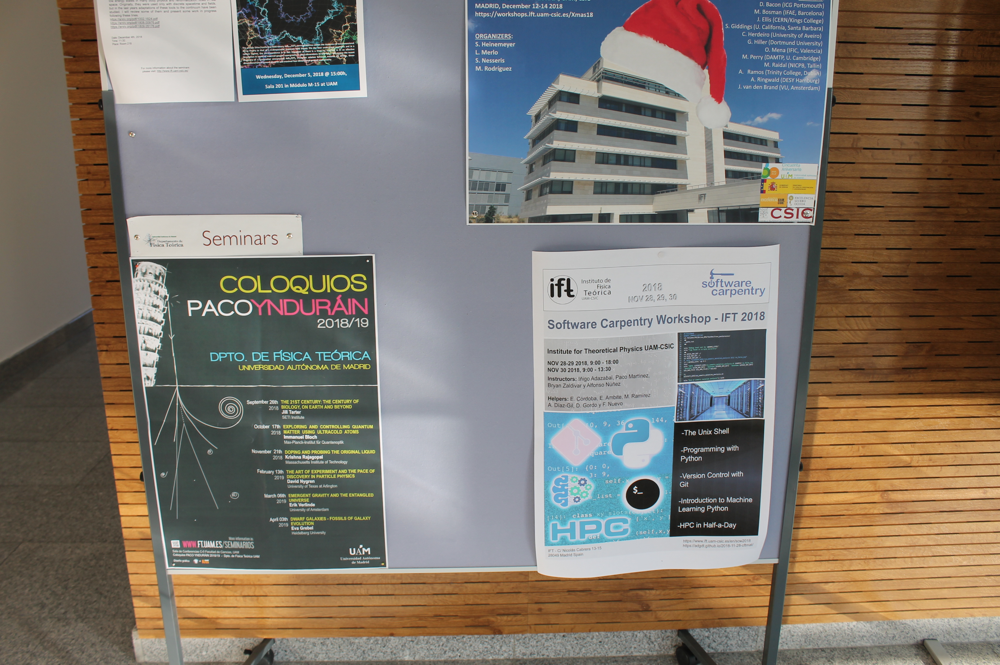
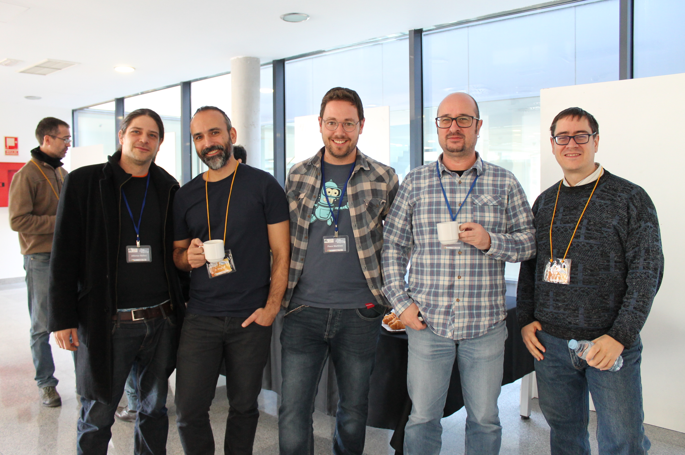
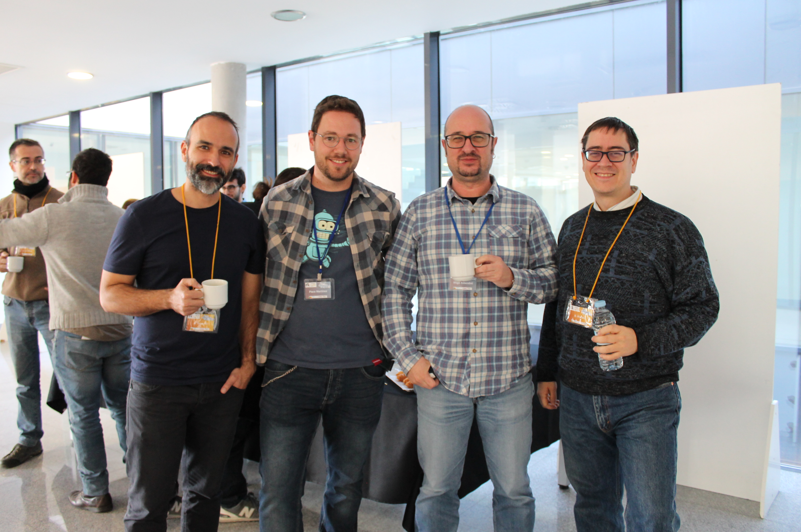

Ahí estuve como instructor certificado de las [Carpentries](https://carpentries.org) en el Workshop para la gente del [Instituto de Física Teórica (IFT)](https://www.ift.uam-csic.es) y el [Instituto de Ciencias Matemáticas (ICMAT)](https://www.icmat.es) del CSIC, en Madrid. Ha sido mi primera experiencia y estoy muy agradecido a los organizadores por contar conmigo. Muchísimas gracias a todos!

El link al workshop: https://adgdt.github.io/2018-11-28-cftmat/
